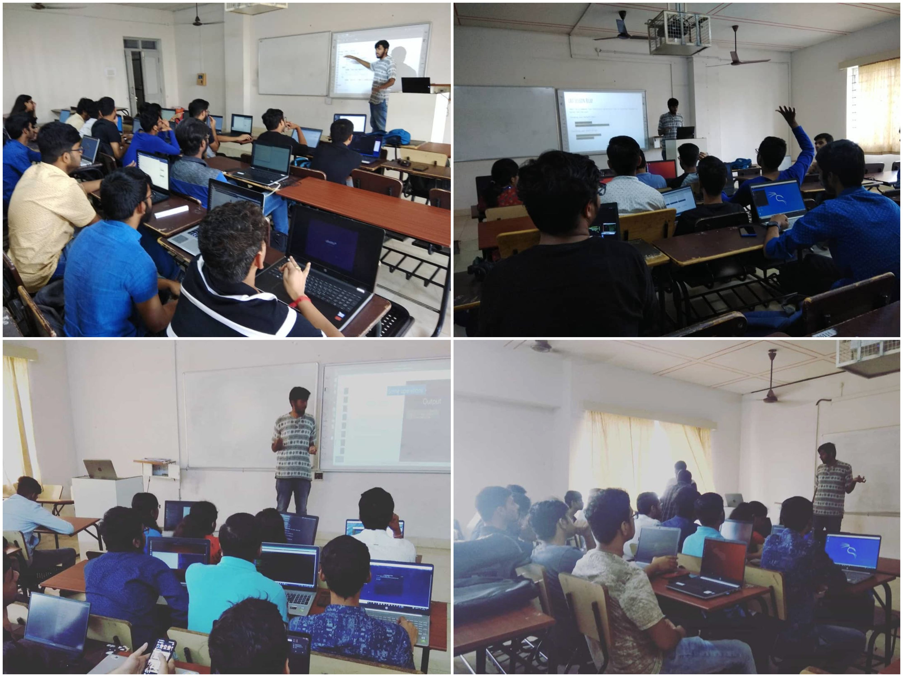

Recently I made two presentations on getting started with shell scrtipting and its applications. Answering questions like what is shell scripting? How will it be useful? How does one get started with shell scripting?

<figure>
  
  <figcaption>
    VIT - Linux Users' Group - Session 1 and 2 [An Introduction to Shell
    Scripting]
  </figcaption>
</figure>

All the code can be found in this Github Repository - <a href="https://github.com/nishalkulkarni/VITLUG-SS2">VITLUG-SS2</a>

If you just want to refer to the slides I used during the presentation you can click on these two links.

<ul>
  <li>
    <a href="https://github.com/nishalkulkarni/VITLUG-SS2/blob/master/Slides/Shell%20VIT-LUG(2).pdf">
      Introduction to Shell Scripting
    </a>
  </li>
  <li>
    <a href="https://github.com/nishalkulkarni/VITLUG-SS2/blob/master/Slides/Shell%20Next%20Steps.pdf">
      Shell Scripting Next Steps
    </a>
  </li>
</ul>
