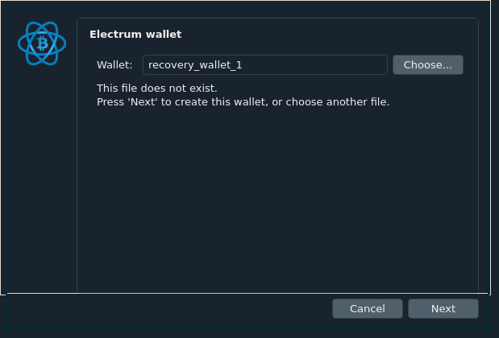
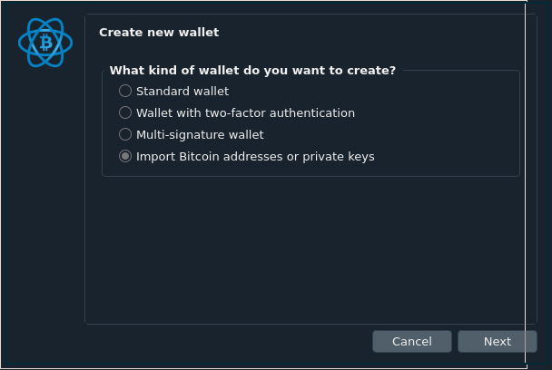
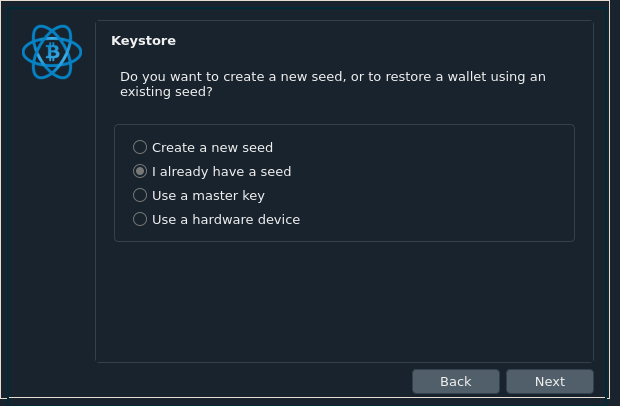
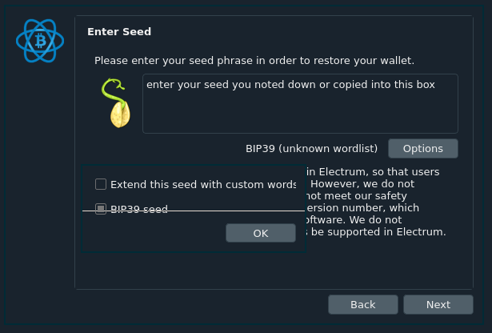
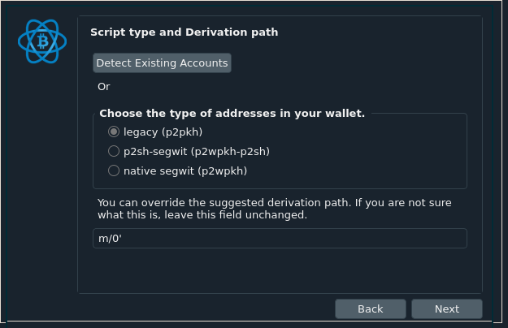
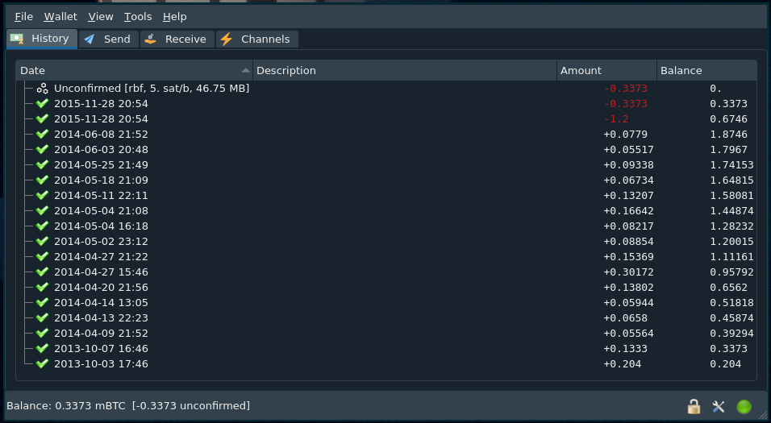

Hey you, Yes you!

Mined some bitcoin back in the good ol' days, stored them in this thing called a MultiBit wallet?

Recently found out that Bitcoin price hit 50,000 USD and now you want to access those old coins you had lying in your wallet?

Well I was in the same boat a few days ago, infact I had completely forgot that I had some of this digital gold lying dormant on the hard-drive of my old pc.
Luckily I was able to find some of the wallet files and keys and managed to back them up and move it to my laptop.
Alas, my journey to becoming filthy rich wasn't over yet.
I soon found out that the wallets which I had kept my coins in (both MultiBit Classic and MultiBit HD)
were deprecated (basically dead).

## So what now ? How do I recover my MONIES ?

Well after digging around a lot of forums, I found out that because I had all the files created by the wallet, I need not worry.
My coins were safe! However recovering these coins seemed a bit confusing at first and that's why I'm writing this article... to help you! the confused and possible rich person 😅

**Disclaimer**: I'm not the original author for some of the stuff written below, I have glued pieces from different places to make it convenient and save you the effort of jumping between 10 tabs on your browser. Reference links given at the end.

### Step 0 - Locating your wallet files

In case you don't know where to find your files look in these directories.

#### Mac OS

| Version              | Wallet file location                                                   |
| -------------------- | ---------------------------------------------------------------------- |
| **Multibit Classic** | ~/Library/Application Support/MultiBit/\*.wallet                       |
| **MultibitHD**       | ~/Library/Application Support/MultiBitHD/`<wallet-id>`/mbhd.wallet.aes |

<br />

#### Windows

| Version              | Wallet file location                                                             |
| -------------------- | -------------------------------------------------------------------------------- |
| **Multibit Classic** | C:\Users\\`<username>`\AppData\Roaming\MultiBit\\`<wallet-name>`.wallet          |
| **MultibitHD**       | C:\Users\\`<username>`\AppData\Roaming\MultiBitHD\\`<wallet-id>`\mbhd.wallet.aes |

<br />

Here `<wallet-id>` is a unique identifier for a wallet, a seemingly random directory name. It starts with `mbhd-`
followed by a long string of letters, numbers and dashes. You will have
one directory like this for each wallet.

`<wallet-name>` is the name that you gave the wallet when you created
it. You will have a ``<wallet-name>`.wallet` file for each wallet.

`<username>` is your windows user name.

Once you figure out the name and location of your wallet file, you can export the keys.
I would suggest you copy this entire folder to a location which is easily accessible like your Desktop.

### Step 1 - Exporting your keys

You'll need some pre-requisite software utilities to get the job done.

The first one is NodeJS (Don't worry, you don't need to know any programming). Head on over to <a href="https://nodejs.org/en/download/" target="_blank">NodeJS Download Link</a>.
You'll install it like any other software you install on your system. If you are stuck there are a lot of "How to" videos/guides out there!

After installing node you'll need to install command-line utility for extracting your keys called `mbexport-rd`.
The install process is simple, open up your command line/terminal and type

`npm install -g mbexport-rd`

**Note**: While you might find some old guides telling you to install **mbexport**, it does not work! I don't know why exactly but the developers have long forgotten about it. **mbexport-rd** offers a fix and works pretty much the same.

Now onto actually exporting the keys!

Don't close the command-line/terminal just yet, we need to run one last command. Keep your wallet location handy, type in the following command and hit enter.

`mbexport-rd <path-to-wallet-file>`

For example, if you are using Multibit HD on MacOS, you would type something like:

`mbexport-rd ~/Library/Application\ Support/MultiBitHD/mbhd-aff7bb4a-8a5d9101-e7e97974-f999c7fb-53795c76/mbhd.wallet.aes`

As I had moved my wallet files to a convenient location I used this command on Linux

`mbexport-rd ~/Wallets/BTC/Nishal.wallet`

**TIP**: If you can find the wallet file in the file explorer application, you can type mbexport-rd in the command prompt, then drag the file from explorer to the command prompt. It should fill in the long file name for you.

When you run the above command, it will ask you to enter the passphrase for your wallet. If you can't remember it then welp it might be the end of the journey for you here 🙁, or if you have some clue as to what it might be you can try brute-forcing your way in either by yourself or using some external application.

Once you do, it will list any private keys and mnemonic seeds that it finds in the file. If you run mbexport-rd on a Multibit Classic file, the output will look simliar to this:

```
multibit classic wallet opened
Enter your passphrase: ***
L5PUQVHfdaHmV8z4u4572ATv2EUiLhZDnMrp5QUBCqiMzJxr5gYL
```

<br />

For Multibit HD, it will look like:

```
MultibitHD wallet opened
Enter your passphrase: ***
measure swim globe radio reunion awful reflect tail produce treat cluster ...
```

<br />

Make sure you either copy or note down the random string of letters and digits (for Multibit Classic) or the 12/13 words (for MultibitHD). Remember that these are your private keys/recovery seed and you should never share them with anyone.

### Step 2 - Creating an Electrum Wallet and Importing Keys

We are almost there now, all that's left is to move those coins to a wallet which is not dead yet 😂
We'll be using Electrum Wallet to recover our coins as it is fairly lightweight and serves our purpose just fine.

<a href="https://electrum.org/#download" target="_blank">
  Download Electrum Wallet
</a>

Again install like you would install any other software, there are plenty of tutorials out there if you need help or are stuck somewhere.

Launch electrum wallet, now there are two different procedures depending on whether you had Multibit Classic or MultibitHD wallet previously.

#### Multibit Classic using private key

Create a new wallet, it will open up when you first create the wallet or you can go to File->New/Restore

<figure>
  
  <figcaption>Name the wallet whatever you feel like and click Next</figcaption>
</figure>

Select "Import Bitcoin addresses or private keys" and click next

<figure>
  
  <figcaption>Name the wallet whatever you feel like and click Next</figcaption>
</figure>

On the next screen it will ask you to enter you private keys, put all of them (each on a separate line) and click next. Again your private key will be a set of random alpha-numeric digits beginning with L or K.

Finally it will ask you for a password which you will setup if you like keeping your money safe.

#### MultibitHD using seed words

Like in Multibit Classic you create a new wallet, it will open up when you first create the wallet or you can go to File->New/Restore. Give it any name you fancy and click next.

Select Standard Wallet and click next

<figure>
  
</figure>

Select I already have a seed and click next

<figure>
  
</figure>

Now on this screen you need to fill in the 12/13 words you had gotten from mbexport-rd.
After inputing the right seed it should show "CHECKSUM: ok"

<figure>
  
  <figcaption>
    Make sure to select the "BIP39 Seed" option by opening the options menu
  </figcaption>
</figure>

Finally set the type as legacy (p2pkh) and the derivation path as m/0'

<figure>
  
</figure>

On the next screen it asks you for a password to protect your new wallet,
doing that should be a no-brainer.

### Voila! it might take a few seconds or minutes but you'll see all your coins in there!

<figure>
  
</figure>

<br />

#### Reference links
* <a href="https://github.com/Multibit-Legacy/read-multibit-wallet-file" target="_blank">
  Original mbexport Github page
</a>

* <a href="https://www.npmjs.com/package/mbexport-rd" target="_blank">
  NPM page for mbexport-rd with documentation
</a>

<br />

## Now onto the disastorous painting 😂

<figure>
  
  <figcaption>Second time's definetly not the charm 🙅</figcaption>
</figure>

Again, I know I suck at it (totally botched up the right one xD) still nice activity for the weekend. 

Au revoir
