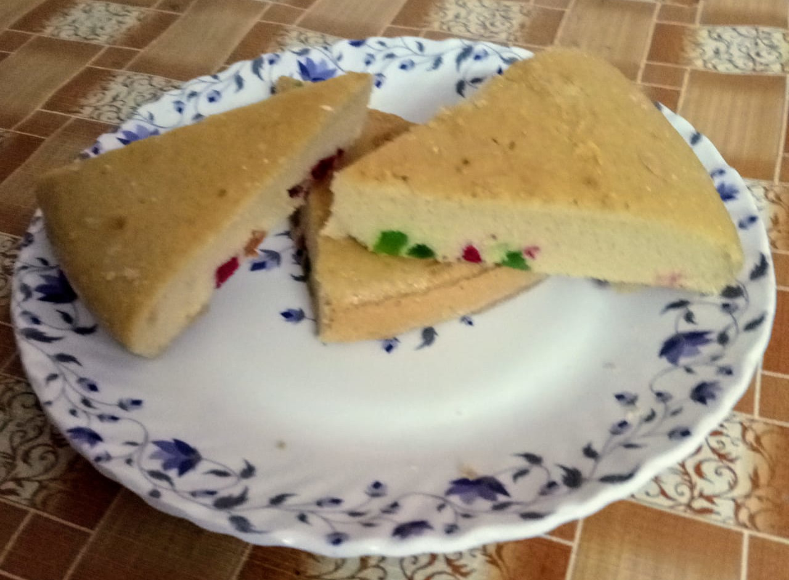
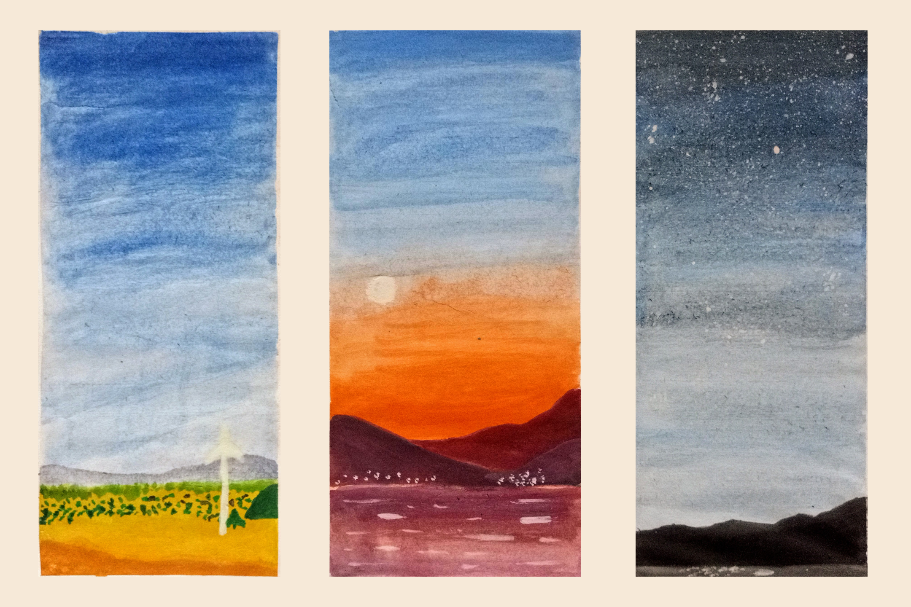

I hope I complete this article and don't take a year to release another one.

So, hi to all the web crawlers going through my site right now! if you haven't figured out already by the domain name or the large heading when you open this website... I'm Nishal.

I launched this site I guess about a year or two ago hoping that I'll document and present my life in a way I deemed fit, i.e. not on a social media platform constantly profiling me to generate targeted ads. Alas, my own laziness kept me from doing exactly that.

2020 was a not so productive year filled with a series of downs points, a lot of stressing out about my future and constantly being annoyed with the people around me "virtually" (you know with the pandemic situation and all)

2021 started off in the same way for the most parts. However, I want to make 2021 count. I want to explore new stuff, learn new skills, hone existing ones and most importantly have a year to myself...

Okay enough with the teenage sob story, I'll share something a bit more exciting now! 😂
On my adventures of learning new stuff I tried out 2 things in the past week.

## #1 Baking a vanilla cake.
<figure>
  
  <figcaption>
    Well vanilla cake with tutti-frutti I guess xD 
  </figcaption>
</figure>

The cake tasted delicious! Random youtube tutorial and dad's help FTW

## #2 Watercolor painting.
<figure>
  
  <figcaption>
    Now I know why I'm an engineer 🤦‍♂️
  </figcaption>
</figure>

I was never really a good painter (although my parents and friends try to be nice about it) but yeah, I picked up a brush in a really long time. The entire experience was oddly satisfying. I made a lot of mistakes as is obvious but still I see myself doing this just to relax on a weekend.

That's about it, it's 1 AM now and I have a lecture at 8 AM. I should probably get some good night's sleep since that's another thing which I hilariously struggle at... Also I plan on mixing a few of these personal update type posts with the technical stuff so that you the web crawler don't feel that everything here is so monotonic.

Auf Wiedersehen